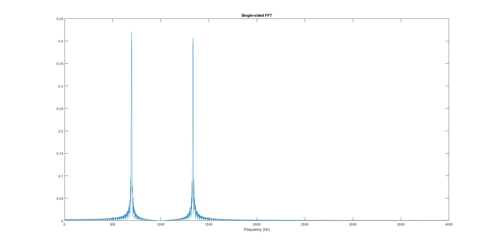
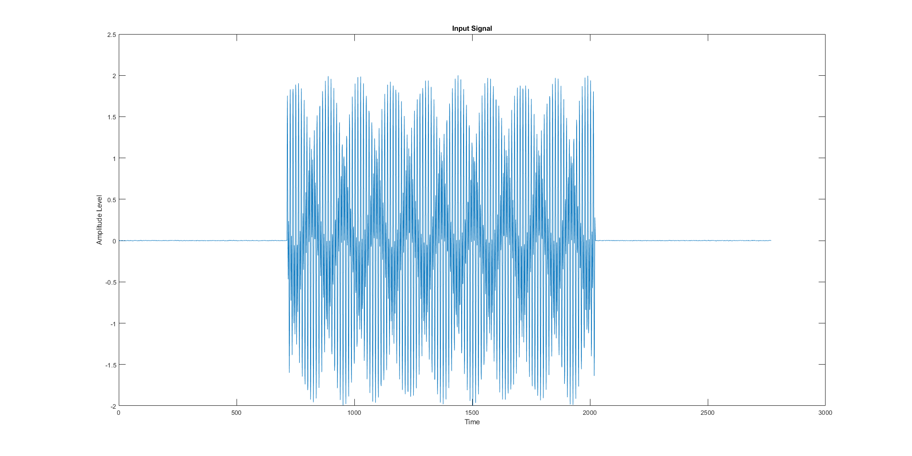

# DTMF
Dual-tone Multi touch frequency(DTMF) decoder-encoder.

This project is partially complete.

This is the fourier plot.

This is a sample signal.

Now I intend to create a GUI Dialler and o/p screen.
